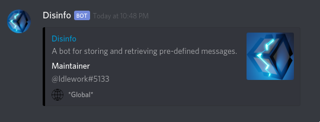

# Disinfo

<h3 align="center">A Discord bot for storing and retrieving pre-defined messages.<h3>

  

<a href="https://github.com/disunity-hq/disinfo/blob/master/docs/USERGUIDE.md">User Guide</a> 
/
<a href="https://github.com/disunity-hq/disinfo/blob/master/docs/QUICKREF.md">Quick Reference</a>

## Overview

  

Discord has a feature where bots are able to send a special kind of message not available to normal users. These are called "embeds". 

Disinfo allows users to store and retrieve embed messages by keyword. This is handy for sharing often referenced information between users.

## Building

Disinfo is built with [Dotnet Core 2.2](https://dotnet.microsoft.com/download/dotnet-core/2.2) and [Paket](https://github.com/fsprojects/Paket) is used for dependency management.

### Installing dependencies

Paket is included in the repo at `.paket/paket.exe`. Run it to install the dependencies:

    $ .paket\paket.exe install

On Linux:

    $ mono .paket\paket.exe install

### Building the project

Once the dependencies have been restored, use the `dotnet` command to build or run the project:

    $  dotnet build Disunity.Disinfo/Disunity.Disinfo.csproj

Or

    $  dotnet run --project Disunity.Disinfo/Disunity.Disinfo.csproj

### Using Docker and Docker-compose

If you have [Docker](https://www.docker.com/) and [Docker Compose](https://docs.docker.com/compose/) installed, then building and running is very simple:

First copy the `.env.template` to `.env` and edit it with your desired settings:

    $ cp .env.template .env
    $ emacs .env

Then simply run:

    $ docker-compose up

# Environment Variables

Disinfo has a number of environment variables which control its behavior:

| Environment Variable | Description                     |
|----------------|---------------------------------------|
| Discord__Token | Your Discord bot token                |
| Db__Path       | The filename of your Disinfo database |

